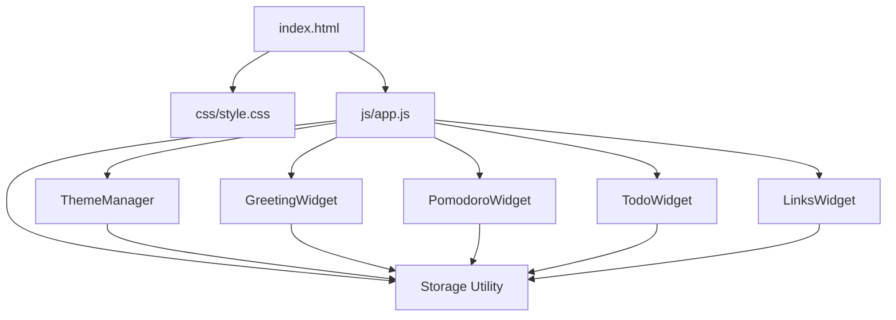

# Design Document: Life Dashboard

## Overview

The Life Dashboard is a single-page web application (SPA) built with plain HTML, CSS, and Vanilla JavaScript. It delivers five integrated widgets — Greeting & Time, Pomodoro Timer, Smart To-Do List, Quick Links, and Theme Switcher — within a "Dark Elegance" aesthetic. All user data persists exclusively via the browser `localStorage` API. No build step, server, or external dependency is required.

The application ships as three files:
- `index.html` — markup and widget scaffolding
- `css/style.css` — all visual styles, themes, and animations
- `js/app.js` — all widget logic, state management, and localStorage I/O

---

## Architecture

The application follows a **module-per-widget** pattern inside a single `app.js` file. Each widget is an IIFE-style module with its own `init()`, render, and event-binding functions. A shared `Storage` utility wraps `localStorage` reads/writes. A `ThemeManager` module handles theme application at load time (before first paint) to prevent flash of unstyled content (FOUC).



### Initialization Order

1. `ThemeManager.apply()` — runs synchronously before DOM content renders to prevent theme flash
2. `DOMContentLoaded` fires
3. Each widget's `init()` is called in sequence: Greeting → Pomodoro → Todo → Links
4. `ThemeManager.bindToggle()` — attaches the toggle button event listener

---

## Components and Interfaces

### Storage Utility

```js
Storage = {
  get(key)         // returns parsed JSON or null
  set(key, value)  // serializes value to JSON and writes to localStorage
  remove(key)      // removes key from localStorage
}
```

Storage keys:
| Key | Widget | Value type |
|---|---|---|
| `ld_name` | Greeting | `string` |
| `ld_pomodoro_duration` | Pomodoro | `number` (minutes) |
| `ld_tasks` | Todo | `Task[]` |
| `ld_links` | Links | `QuickLink[]` |
| `ld_theme` | Theme | `"dark" \| "light"` |

---

### ThemeManager

```js
ThemeManager = {
  apply()       // reads ld_theme from localStorage, sets data-theme on <html> before paint
  bindToggle()  // attaches click handler to #theme-toggle button
  toggle()      // flips theme, saves to localStorage, updates button label/icon
}
```

Theme is applied via a `data-theme` attribute on `<html>`. CSS custom properties switch based on `[data-theme="light"]` selector.

---

### GreetingWidget

```js
GreetingWidget = {
  init()           // loads saved name, starts clock tick, binds name form
  tick()           // updates time/date display every second via setInterval
  getGreeting(h)   // pure function: hour (0–23) → greeting string
  renderGreeting() // composes greeting + name and updates DOM
  saveName(name)   // persists name to localStorage
}
```

---

### PomodoroWidget

```js
PomodoroWidget = {
  init()              // loads saved duration, renders timer, binds controls
  start()             // begins setInterval countdown
  stop()              // clears interval, pauses countdown
  reset()             // stops and restores to configured duration
  tick()              // decrements remaining seconds, updates display, checks for zero
  formatTime(s)       // pure function: seconds → "MM:SS" string
  saveDuration(mins)  // persists custom duration to localStorage
  showEndNotification() // displays visual end-of-session indicator
}
```

State held in module-level variables: `remaining` (seconds), `intervalId`, `configuredDuration` (seconds).

---

### TodoWidget

```js
TodoWidget = {
  init()                  // loads tasks from localStorage, renders list, binds add form
  addTask(text)           // validates, deduplicates, creates Task, saves, re-renders
  editTask(id, newText)   // updates task text, saves, re-renders
  toggleTask(id)          // flips task.done, saves, re-renders
  deleteTask(id)          // removes task by id, saves, re-renders
  sortTasks()             // reorders: incomplete first, then completed
  render()                // full re-render of task list from state array
  save()                  // writes tasks array to localStorage
}
```

---

### LinksWidget

```js
LinksWidget = {
  init()              // loads links from localStorage, renders, binds add form
  addLink(name, url)  // creates QuickLink, saves, re-renders
  deleteLink(id)      // removes link by id, saves, re-renders
  render()            // full re-render of links list from state array
  save()              // writes links array to localStorage
}
```

---

## Data Models

### Task

```js
{
  id:        string,   // crypto.randomUUID() or Date.now().toString()
  text:      string,   // task description
  done:      boolean,  // completion state
  createdAt: number    // Unix timestamp (ms)
}
```

### QuickLink

```js
{
  id:   string,  // crypto.randomUUID() or Date.now().toString()
  name: string,  // display label
  url:  string   // full URL (must include protocol)
}
```

---

## Layout

CSS Grid drives the dashboard layout. On wide screens, widgets arrange in a 2–3 column grid. On narrow screens (< 768px), the grid collapses to a single column.

```
┌─────────────────────────────────────────┐
│  [Theme Toggle]                         │
├──────────────────┬──────────────────────┤
│  Greeting & Time │  Pomodoro Timer      │
├──────────────────┴──────────────────────┤
│  Smart To-Do List                       │
├──────────────────┬──────────────────────┤
│  Quick Links     │  (future widget slot)│
└──────────────────┴──────────────────────┘
```

Each widget is a `<section>` with class `widget-card` styled as a Glassmorphism_Card.

---

## Visual Design

### CSS Custom Properties (Dark Mode defaults)

```css
:root {
  --bg-primary:      #0d0f1a;   /* Midnight Blue */
  --bg-card:         rgba(255,255,255,0.05);
  --border-card:     rgba(255,255,255,0.12);
  --accent:          #c9a84c;   /* Champagne Gold */
  --accent-secondary:#b76e79;   /* Rose Gold */
  --text-primary:    #f0ece4;
  --text-muted:      #8a8a9a;
  --shadow-card:     0 8px 32px rgba(0,0,0,0.45);
  --blur:            blur(16px);
  --transition:      all 0.3s ease;
}

[data-theme="light"] {
  --bg-primary:   #f8f5ef;   /* Cream */
  --bg-card:      rgba(255,255,255,0.75);
  --border-card:  rgba(0,0,0,0.08);
  --accent:       #b8860b;   /* Dark Gold */
  --text-primary: #1a1a1a;
  --text-muted:   #555555;
  --shadow-card:  0 8px 32px rgba(0,0,0,0.12);
}
```

### Glassmorphism Card

```css
.widget-card {
  background:    var(--bg-card);
  border:        1px solid var(--border-card);
  border-radius: 16px;
  backdrop-filter: var(--blur);
  box-shadow:    var(--shadow-card);
  transition:    var(--transition);
}
```

---

## Error Handling

| Scenario | Handling |
|---|---|
| Duplicate task submission | Inline error message shown below input; input retains focus |
| Empty task/link submission | Form validation prevents submission; no localStorage write |
| Invalid URL for Quick Link | Basic `URL` constructor validation; error shown inline |
| localStorage unavailable | `try/catch` in Storage utility; graceful degradation (in-memory only) |
| Timer already running on Start | Start button disabled while `intervalId` is set |

---


## Correctness Properties

*A property is a characteristic or behavior that should hold true across all valid executions of a system — essentially, a formal statement about what the system should do. Properties serve as the bridge between human-readable specifications and machine-verifiable correctness guarantees.*

---

### Property 1: Greeting maps correctly for all hours

*For any* integer hour in [0, 23], `getGreeting(h)` SHALL return "Good Morning" when h ∈ [5,11], "Good Afternoon" when h ∈ [12,17], "Good Evening" when h ∈ [18,21], and "Good Night" when h ∈ [22,23] or h ∈ [0,4].

**Validates: Requirements 4.3, 4.4, 4.5, 4.6**

---

### Property 2: Greeting includes name for all valid names

*For any* non-empty name string and any hour in [0,23], the rendered greeting string SHALL contain both the time-of-day phrase (e.g., "Good Morning") and the name.

**Validates: Requirements 4.8**

---

### Property 3: Name persistence round-trip

*For any* non-empty name string, after `saveName(name)` is called, `Storage.get('ld_name')` SHALL return the same string.

**Validates: Requirements 4.9, 4.10**

---

### Property 4: Timer format is always MM:SS

*For any* non-negative integer `s` (seconds), `formatTime(s)` SHALL return a string matching the pattern `\d{2}:\d{2}` where the minutes component equals `Math.floor(s / 60)` and the seconds component equals `s % 60`, both zero-padded to two digits.

**Validates: Requirements 5.9**

---

### Property 5: Pomodoro duration persistence round-trip

*For any* positive integer `mins`, after `saveDuration(mins)` is called, `Storage.get('ld_pomodoro_duration')` SHALL return the same value.

**Validates: Requirements 5.7, 5.8**

---

### Property 6: Task addition round-trip

*For any* non-empty task text string that does not already exist in the task list (case-insensitive), after `addTask(text)` is called, the in-memory tasks array SHALL contain a task with that text, and `Storage.get('ld_tasks')` SHALL contain the same task.

**Validates: Requirements 6.2, 6.12**

---

### Property 7: Duplicate task rejection

*For any* task text T already present in the task list, attempting to add T again (in any casing variation) SHALL leave the tasks array unchanged and SHALL not write a duplicate to LocalStorage.

**Validates: Requirements 6.3**

---

### Property 8: Task edit persistence round-trip

*For any* existing task id and any non-empty new text string, after `editTask(id, newText)` is called, `Storage.get('ld_tasks')` SHALL contain exactly one task with that id whose text equals `newText`.

**Validates: Requirements 6.5**

---

### Property 9: Task completion toggle is an involution

*For any* task, calling `toggleTask(id)` twice SHALL result in the same `done` state as before the first toggle. After a single `toggleTask(id)` call, `Storage.get('ld_tasks')` SHALL reflect the new `done` state.

**Validates: Requirements 6.6, 6.7, 6.8**

---

### Property 10: Task deletion removes from list and storage

*For any* task id present in the tasks array, after `deleteTask(id)` is called, the tasks array SHALL contain no task with that id, and `Storage.get('ld_tasks')` SHALL contain no task with that id.

**Validates: Requirements 6.9, 6.10**

---

### Property 11: Sort places incomplete tasks before completed tasks

*For any* array of tasks with mixed `done` states, after `sortTasks()` is applied, for every pair of indices (i, j) where i < j, it SHALL NOT be the case that `tasks[i].done === true` and `tasks[j].done === false`.

**Validates: Requirements 6.11**

---

### Property 12: Quick Link persistence round-trip

*For any* non-empty name string and valid URL string, after `addLink(name, url)` is called, `Storage.get('ld_links')` SHALL contain a link with that name and url. After `deleteLink(id)` is called for any link id, `Storage.get('ld_links')` SHALL contain no link with that id.

**Validates: Requirements 7.4, 7.6, 7.7**

---

### Property 13: Theme toggle is an involution with persistence

*For any* starting theme state (`"dark"` or `"light"`), calling `ThemeManager.toggle()` twice SHALL result in the same theme as the starting state. After a single `toggle()` call, `Storage.get('ld_theme')` SHALL equal the new (opposite) theme, and the `data-theme` attribute on `<html>` SHALL reflect that theme.

**Validates: Requirements 8.2, 8.3, 8.5**

---

## Testing Strategy

### Dual Testing Approach

Unit tests cover specific examples, edge cases, and error conditions. Property-based tests verify universal properties across all inputs. Both are complementary.

### Property-Based Testing Library

Use **fast-check** (JavaScript) for property-based tests. Each property test runs a minimum of **100 iterations**.

Tag format for each property test:
```
// Feature: life-dashboard, Property N: <property_text>
```

### Property Tests (one per property)

| Property | What varies | Key assertion |
|---|---|---|
| P1: Greeting by hour | Random integer in [0,23] | Correct greeting string returned |
| P2: Greeting includes name | Random non-empty string + random hour | Output contains phrase and name |
| P3: Name round-trip | Random non-empty string | Storage.get returns same value |
| P4: formatTime MM:SS | Random non-negative integer (0–5999) | Output matches regex, values correct |
| P5: Duration round-trip | Random positive integer | Storage.get returns same value |
| P6: Task add round-trip | Random non-empty, non-duplicate text | Task in array and storage |
| P7: Duplicate rejection | Random text already in list | Array unchanged after add attempt |
| P8: Task edit round-trip | Random task id + random new text | Storage reflects updated text |
| P9: Toggle involution | Random task with any done state | Two toggles = original state |
| P10: Task delete | Random task id in list | Task absent from array and storage |
| P11: Sort ordering | Random mixed-done task array | No completed task before incomplete |
| P12: Link round-trip | Random name + valid URL | Link in storage after add; absent after delete |
| P13: Theme toggle involution | Starting theme "dark" or "light" | Two toggles = original; storage reflects new theme |

### Unit Tests

Focus on:
- Default timer initialization (25 minutes)
- Timer end notification at zero
- Empty task/link submission rejection
- Invalid URL rejection for Quick Links
- FOUC prevention: theme applied before `DOMContentLoaded`
- Greeting widget renders saved name on load

### Integration Tests

- Full page load with pre-populated localStorage: all widgets render saved state correctly
- Theme persists across simulated page reload

### Test File Structure

```
tests/
  unit/
    greeting.test.js
    pomodoro.test.js
    todo.test.js
    links.test.js
    theme.test.js
  property/
    greeting.prop.test.js
    pomodoro.prop.test.js
    todo.prop.test.js
    links.prop.test.js
    theme.prop.test.js
  integration/
    dashboard.integration.test.js
```
