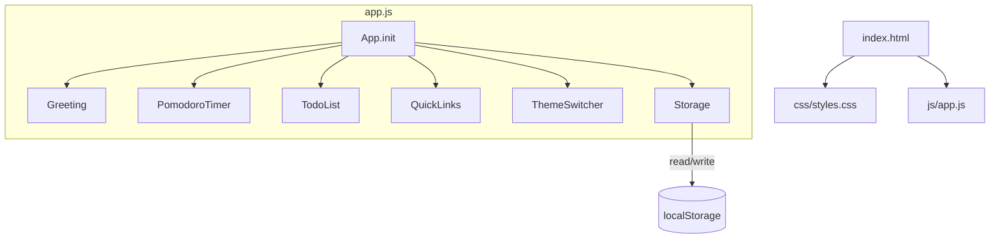
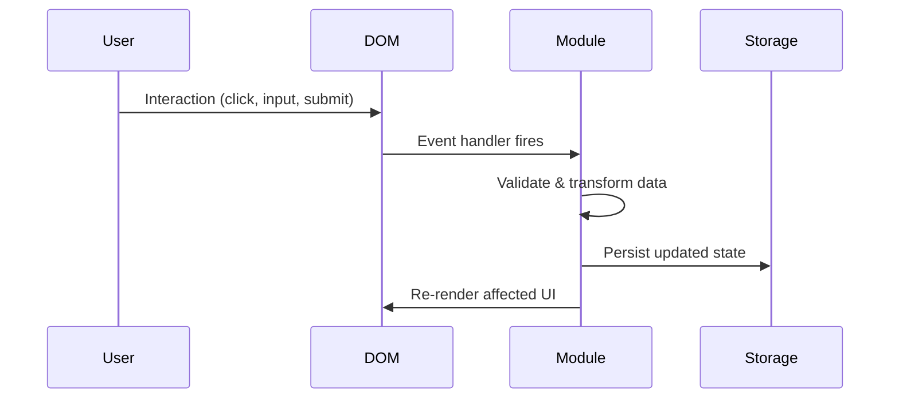

# Design Document: Todo Life Dashboard

## Overview

A single-page, client-side dashboard built with vanilla HTML, CSS, and JavaScript. It consolidates five feature cards — Greeting/Clock, Pomodoro Timer, To-Do List, Quick Links, and Theme Switcher — into one responsive interface. All state is persisted in `localStorage` with no backend.

The architecture is intentionally simple: one HTML file, one CSS file, one JS file. The JS module is organized into feature-scoped namespaces (plain objects) to keep concerns separated without introducing a build step or framework.

---

## Architecture



All modules live in `js/app.js` as plain object namespaces. `App.init()` is the single entry point called on `DOMContentLoaded`. Each module owns its DOM queries, event listeners, and storage keys.

### Data Flow



---

## Components and Interfaces

### Storage Module

Central wrapper around `localStorage`. All keys are namespaced to avoid collisions.

```js
Storage = {
  get(key),          // returns parsed JSON or null
  set(key, value),   // serializes to JSON and writes
  remove(key)        // removes a key
}
```

Storage keys:
| Key | Type | Owner |
|-----|------|-------|
| `tld_name` | `string` | Greeting |
| `tld_pomodoro_duration` | `number` | PomodoroTimer |
| `tld_tasks` | `Task[]` | TodoList |
| `tld_links` | `Link[]` | QuickLinks |
| `tld_theme` | `"light" \| "dark"` | ThemeSwitcher |

### Greeting Module

Owns the greeting card. Runs a `setInterval` every 1000ms to update the clock display. Reads the saved name from storage on init.

```js
Greeting = {
  init(),
  updateClock(),       // called every second
  getGreetingPrefix(), // returns "Good Morning" | "Good Afternoon" | "Good Evening"
  saveName(name),
  render()
}
```

### PomodoroTimer Module

Manages countdown state with a single `intervalId`. Timer state is in-memory only; only `sessionDuration` is persisted.

```js
PomodoroTimer = {
  init(),
  start(),
  stop(),
  reset(),
  tick(),              // decrements remaining, checks for 00:00
  saveCustomDuration(minutes),
  validateDuration(input), // returns { valid: boolean, value: number, error: string }
  render()
}
```

### TodoList Module

Manages an array of `Task` objects. All mutations go through helper functions that also call `Storage.set`.

```js
TodoList = {
  init(),
  addTask(text),
  deleteTask(id),
  toggleTask(id),
  editTask(id, newText),
  setSortOrder(order),  // "pending" | "completed" | "alpha"
  getSortedTasks(),
  validateTask(text),   // returns { valid: boolean, error: string }
  isDuplicate(text),
  render()
}
```

### QuickLinks Module

Manages an array of `Link` objects.

```js
QuickLinks = {
  init(),
  addLink(name, url),
  deleteLink(id),
  normalizeUrl(url),    // prepends https:// if missing scheme
  validateLink(name, url), // returns { valid: boolean, error: string }
  render()
}
```

### ThemeSwitcher Module

Toggles a `data-theme` attribute on `<html>`. CSS variables are scoped to `[data-theme="dark"]`.

```js
ThemeSwitcher = {
  init(),
  toggle(),
  apply(theme),
  render()
}
```

---

## Data Models

### Task

```js
{
  id: string,        // crypto.randomUUID() or Date.now().toString()
  text: string,      // trimmed, non-empty
  completed: boolean,
  createdAt: number  // Date.now() timestamp
}
```

### Link

```js
{
  id: string,
  name: string,      // display label
  url: string        // always starts with http:// or https://
}
```

### AppState (in-memory, not persisted as a whole)

Each module holds its own slice of state. There is no global state object.

---

## Correctness Properties

*A property is a characteristic or behavior that should hold true across all valid executions of a system — essentially, a formal statement about what the system should do. Properties serve as the bridge between human-readable specifications and machine-verifiable correctness guarantees.*

### Property 1: Greeting prefix correctness

*For any* integer hour in [0, 23], `getGreetingPrefix(hour)` SHALL return exactly one of "Good Morning", "Good Afternoon", or "Good Evening", and the returned value SHALL match the correct time range: hours [5, 11] → "Good Morning", hours [12, 17] → "Good Afternoon", hours [18, 23] and [0, 4] → "Good Evening".

**Validates: Requirements 3.3, 3.4, 3.5**

### Property 2: Name persistence round-trip

*For any* non-empty name string, saving it via `Greeting.saveName(name)` and then reading it back from Storage SHALL return the same string, and the rendered greeting SHALL contain that name.

**Validates: Requirements 3.7, 3.8**

### Property 3: Timer display format

*For any* non-negative integer number of remaining seconds S, the formatted display string SHALL match the pattern `MM:SS` where MM is the whole minutes and SS is the remaining seconds, both zero-padded to two digits.

**Validates: Requirements 4.2**

### Property 4: Pomodoro duration validation rejects invalid inputs

*For any* input that is not a positive integer — including zero, negative numbers, non-integer floats, non-numeric strings, and empty string — `validateDuration(input)` SHALL return `{ valid: false }` and the timer display SHALL remain unchanged.

**Validates: Requirements 4.10**

### Property 5: Pomodoro duration persistence round-trip

*For any* valid positive integer duration D, saving it via `saveCustomDuration(D)` and reading it back from Storage SHALL return the numeric value D.

**Validates: Requirements 4.9**

### Property 6: Whitespace and empty tasks are rejected

*For any* string composed entirely of whitespace characters (spaces, tabs, newlines) including the empty string, `validateTask(text)` SHALL return `{ valid: false }` and the task list SHALL remain unchanged after an attempted add.

**Validates: Requirements 5.4**

### Property 7: Duplicate task detection is case-insensitive and trim-aware

*For any* existing task with text T, submitting a new task whose trimmed, lowercased form equals T's trimmed, lowercased form SHALL be rejected as a duplicate and the task list length SHALL remain unchanged.

**Validates: Requirements 5.3**

### Property 8: Task mutations persist correctly

*For any* sequence of add, toggle, edit, and delete operations on the task list, the tasks array read back from Storage after each operation SHALL equal the in-memory tasks array at that point — preserving text, completion state, and the absence of deleted tasks.

**Validates: Requirements 5.2, 5.6, 5.8, 5.10**

### Property 9: Sort order does not mutate stored data

*For any* task list and any sort order ("pending", "completed", "alpha"), calling `setSortOrder()` and re-rendering SHALL produce a correctly ordered view while the tasks array in Storage SHALL remain identical to its pre-sort state.

**Validates: Requirements 5.12**

### Property 10: URL normalization prepends scheme exactly once

*For any* URL string that does not begin with `http://` or `https://`, `normalizeUrl(url)` SHALL return a string that begins with `https://` and contains the original URL string as a suffix, with no double-prepending if called multiple times.

**Validates: Requirements 6.3**

### Property 11: Link mutations persist correctly

*For any* valid link (non-empty name and URL), saving it via `addLink()` and reading back from Storage SHALL include an entry with the same name and normalized URL; and for any saved link, deleting it via `deleteLink(id)` and reading back from Storage SHALL not contain an entry with that id.

**Validates: Requirements 6.4, 6.7**

### Property 12: Theme toggle is an involution

*For any* current theme T ∈ {"light", "dark"}, calling `ThemeSwitcher.toggle()` twice SHALL restore the active theme to T.

**Validates: Requirements 7.2**

### Property 13: Theme persistence round-trip

*For any* theme value T ∈ {"light", "dark"}, calling `ThemeSwitcher.apply(T)` and then reading the theme from Storage SHALL return T.

**Validates: Requirements 7.3, 7.4**

---

## Error Handling

| Scenario | Module | Behavior |
|----------|--------|----------|
| Empty/whitespace task submitted | TodoList | Show inline validation error; do not add |
| Duplicate task submitted | TodoList | Show duplicate warning; do not add |
| Empty name or URL for link | QuickLinks | Show inline validation error; do not save |
| Non-positive-integer Pomodoro duration | PomodoroTimer | Show validation error; do not update timer |
| `localStorage` unavailable (private mode, quota exceeded) | Storage | Catch exception; app continues in-memory, no crash |
| Timer reaches 00:00 | PomodoroTimer | Auto-stop, show completion notification (alert or in-card message) |

All validation errors are displayed inline near the relevant input field and cleared on the next valid submission attempt.

---

## Testing Strategy

### Unit Tests (example-based)

Focus on specific behaviors, defaults, and edge cases:

- `getGreetingPrefix()` returns correct string for boundary hours (0, 5, 12, 18, 23)
- `validateDuration()` rejects 0, -1, 1.5, "abc", "" and accepts 1, 25, 60
- `validateTask()` rejects "", "   ", "\t\n"
- `isDuplicate()` matches "Buy milk" against "buy milk", " Buy Milk "
- `normalizeUrl()` handles "example.com", "http://x.com", "https://x.com", "ftp://x.com"
- Theme defaults to "light" when Storage returns null
- Pomodoro defaults to 25 minutes when Storage returns null
- Timer auto-stops and notifies when tick reaches 0

### Property-Based Tests

Using **fast-check** (JavaScript PBT library). Each test runs a minimum of 100 iterations. Each test is tagged with the property it validates.

**Feature: todo-life-dashboard, Property 1: Greeting prefix correctness**
- Generate arbitrary integers in [0, 23]; assert result is one of the three valid strings and matches the correct range boundary.

**Feature: todo-life-dashboard, Property 2: Name persistence round-trip**
- Generate arbitrary non-empty strings; save via `saveName`, read from Storage, assert equality.

**Feature: todo-life-dashboard, Property 3: Timer display format**
- Generate arbitrary non-negative integers (seconds); assert formatted string matches `/^\d{2}:\d{2}$/`.

**Feature: todo-life-dashboard, Property 4: Pomodoro duration validation rejects invalid inputs**
- Generate non-positive numbers, floats, and non-numeric strings; assert `validateDuration` returns `{ valid: false }`.

**Feature: todo-life-dashboard, Property 5: Pomodoro duration persistence round-trip**
- Generate positive integers; save via `saveCustomDuration`, read from Storage, assert numeric equality.

**Feature: todo-life-dashboard, Property 6: Whitespace and empty tasks are rejected**
- Generate strings from `fc.stringOf(fc.constantFrom(' ', '\t', '\n', '\r'))`; assert `validateTask` returns `{ valid: false }`.

**Feature: todo-life-dashboard, Property 7: Duplicate task detection is case-insensitive and trim-aware**
- Generate a task text, add it, then generate case/whitespace variants; assert all are rejected as duplicates and list length is unchanged.

**Feature: todo-life-dashboard, Property 8: Task mutations persist correctly**
- Generate sequences of add/toggle/edit/delete operations; after each, assert Storage array equals in-memory array.

**Feature: todo-life-dashboard, Property 9: Sort order does not mutate stored data**
- Generate task lists and sort orders; apply sort, assert Storage unchanged and rendered order matches expected comparator.

**Feature: todo-life-dashboard, Property 10: URL normalization prepends scheme exactly once**
- Generate arbitrary strings without `http://` or `https://` prefix; assert `normalizeUrl` result starts with `https://` and calling it again produces the same result (idempotent).

**Feature: todo-life-dashboard, Property 11: Link mutations persist correctly**
- Generate valid links; add, read Storage, assert present; delete, read Storage, assert absent.

**Feature: todo-life-dashboard, Property 12: Theme toggle is an involution**
- For each starting theme, call `toggle()` twice; assert final theme equals initial theme.

**Feature: todo-life-dashboard, Property 13: Theme persistence round-trip**
- For each theme value; apply via `apply(theme)`, read from Storage, assert equality.

### Integration Tests

- Full page load restores all persisted state (name, theme, tasks, links, Pomodoro duration)
- Pomodoro timer counts down correctly over multiple ticks (mock `setInterval`)
- Sort control re-renders tasks in correct order without modifying Storage
